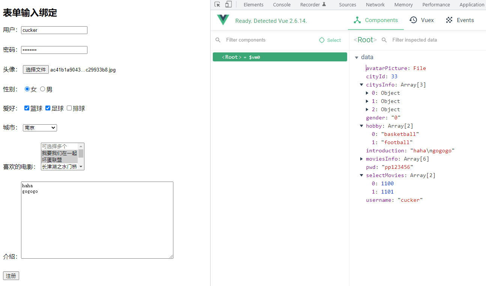

# vue核心

## vue是什么
The Progressive JavaScript Framework（渐近式JavaScript框架）

先只用vue核心组件，需要功能再加进哪个组件(路由组件、状态管理组件)

doc文档
* https://vuejs.org/
* https://cn.vuejs.org/
* https://github.com/vuejs/vue

作者：尤雨溪(Evan You)，曾就职于 Google Creative Labs 和 Meteor Development Group。

作用：动态构建用户界面。

### vue特点
* 遵循MVVM模式
* 编码简洁，体积小，运行效度高，适合移动/PC端开发
* 它本身只关注UI，可以轻松引入vue插件或其它第三方库开发项目

与其它前端JS框架的关联
* 借鉴了angular的模板和数据绑定技术。
* 借鉴了react的组件化和虚拟DOM技术。


### vue插件
* vue-cli  
    vue脚手架
* vue-resource(axios)  
    ajax请求
* vue-router  
    路由
* vuex  
    状态管理
* vue-lazyload  
    图片懒加载
* vue-scroller  
    页面滑动相关
* mint-ui  
    基于vue的UI组件库(移动端)
* element-ui  
    基于vue的UI组件库(PC端)
* ant-design-vue  
    基于vue的UI组件库(PC端)


## vue的基本使用

### vue Hello World
[helloWorld.html](../vue_basic/helloWorld.html)


[](../static/video/vue_helloWorld.wmv "Vue Hello World")


* Vue的调试工具  
    Vue Devtools

* 理解MVVM
    * M  
        model，模型，数据对象(data)
    * V  
        view，视图，模板页面
    * VM  
        view model，视图模型(一个Vue的实例对象)

    
    


## 模板语法

### 插值
#### 插入文本
插入的是普通文本

* 语法
    ```html
    {{变量}}
    ```
    Mustache标签
    
* 示例
    ```html
    <html>
    <head>
        <script src="../static/js/vue.js"></script>
    </head>
    
    <body>
    <div id="app">
        <span>Message: {{msg}}</span>
    </div>
    
    <script type="text/javascript">
        const vm = new Vue({
            el: '#app',
            data: { 
                msg: 'Hello Vue!'
            }
        })
    </script>
    
    </body>
    </html>
    ```
    当 msg 数据改变时，html上值也会更行.

* 一次性插入值

    通过使用 `v-once` 指令，你也能执行一次性地插值，当数据改变时，插值处的内容不会更新。但请留心这会影响到该节点上的其它数据绑定
    ```html
    <span v-once>这个将不会改变: {{ msg }}</span>
    ```

#### 插入原始html
插入原始html，显示真正的html。

使用`v-html` 指令。 

[示例rawHtml.html](../templateSyntax/rawHtml.html)
```html
<!DOCTYPE html>
<html lang="en">
<head>
    <meta charset="UTF-8">
    <title>Title</title>
    <script src="../static/js/vue.js"></script>
</head>
<body>
<div id="app">
    <p>Using mustaches普通文本: {{rawHtml}}</p>
    <p>Using v-html directive: <span v-html="rawHtml"></span></p>
</div>

<script>
    const vm = new Vue({
        el: '#app',
        data: {
            rawHtml: '<span style="color: red">This should be red</span>'
        }
    })
</script>

</body>
</html>
```

效果：


#### html属性绑定变量
使用`v-bind`指令

* 语法
    ```html
    v-bind:属性名="变量名"
    ```

[示例](../templateSyntax/attribute.html)
```html
<div v-bind:id="dynamicId"></div>
```

```html
<button v-bind:disabled="isButtonDisabled">Button</button>
```
当变量`isButtonDisabled`不为 null、undefined 或 false，则等效于 `disabled="disabled"`


#### 使用JavaScript表达式
[示例](../templateSyntax/javascriptExpression.html)

```html
    <!-- 算术运算 -->
    <p>{{ number + 1 }}</p>

    <!-- 三元表达式 -->
    <p>
        <span>3 > 4 ?</span>
        {{ 3 > 4 ? 'YES' : 'NO' }}
    </p>

    <!-- 调用方法 -->
    <div>{{ msg.split('').reverse().join('') }}</div>

    <!-- 字符串连接 -->
    <p v-bind:id="'no_' + dynamicId">字符串连接</p>
```

### 指令
指令是带有 `v-` 前缀的特殊 html属性。
如 v-bind:、v-on:、v-model、v-once、v-show、v-pre、v-html、v-text、v-if、v-else、v-else-if、

指令的职责是：当表达式的值改变时，将产生的连带影响，响应式地作用于DOM。`v-for`指令除外。

```html
<p v-if="seen">现在你看到我了</p>
```
这里的`v-if`指令将根据表达式`seen`的值的true/false 来插入/移除`<p>`元素

#### 指令参数(静态)
一些指令能够接受一个"参数"

##### 指令将响应式地更新指定的属性
* 语法
    >指令:属性

* 示例
    ```html
    <a v-bind:href="url">点我呀</a>
    ```
    这里的参数是属性名
    
##### 监听DOM事件
* 语法
    >指令:事件名

* 示例
    ```html
    <div v-on:click="func1">提交</div>
    ```
    这里的参数是事件名
    
#### 指令动态参数
v2.6.0新增

使用"[参数]"的JavaScript表达式来表示动态指令参数。

* 动态参数为属性
    ```html
    <a v-bind:[attribute_name]="url"> ... </a>
    ```
    这里的 `attributeName` 会被作为一个 JavaScript 表达式进行动态求值，求得的值将会作为最终的参数来使用。
    
    例如，如果你的 Vue 实例有一个 data property attributeName，其值为 "href"，`v-bind:[attribute_name]`将等价于 `v-bind:href`。

* 动态参数为事件名
    ```html
    <a v-on:[event_name]="doSomething"> ... </a>
    ```
    在这个示例中，当 eventName 的值为 "focus" 时，`v-on:[event_name]` 将等价于 `v-on:focus`。

##### 对动态参数的值的约束
动态参数预期会求出一个字符串，异常情况下值为 `null`。这个特殊的 `null` 值可以被显性地用于移除绑定。

任何其它非字符串类型的值都将会触发一个警告。

##### 对动态参数表达式的约束
动态参数表达式有一些语法约束，因为某些字符，如`空格`和`引号`，放在 HTML attribute 名里是无效的。

在 DOM 中使用模板时 (直接在一个 HTML 文件里撰写模板)，还需要避免使用大写字符来命名键名，因为浏览器会把 attribute 名全部强制转为小写。

* 示例
    ```html
    <!-- 这会触发一个编译警告 -->
    <a v-bind:['foo' + bar]="value"> ... </a>
    ```
    变通的办法是使用没有空格或引号的表达式，或用计算属性替代这种复杂表达式。


    ```html
    <!--
    在 DOM 中使用模板时这段代码会被转换为 `v-bind:[someattr]`。
    除非在实例中有一个名为“someattr”的 property，否则代码不会工作。
    -->
    <a v-bind:[someAttr]="value"> ... </a>
    ```

#### 事件修饰符
修饰符 (modifier) 是以半角句号 `.` 指明的特殊后缀，用于指出一个指令应该以特殊方式绑定。

* 示例
    `.prevent` 修饰符告诉 v-on 指令对于触发的事件调用 event.preventDefault()
    ```html
    <form v-on:submit.prevent="onSubmit">...</form>
    ```
#### 常用指令的缩写
##### `v-bind:`缩写为`:`
```html
<!-- 完整语法 -->
<a v-bind:href="url">...</a>

<!-- 缩写 -->
<a :href="url">...</a>

<!-- 动态参数的缩写 (2.6.0+) -->
<a :[key]="url"> ... </a>
```

##### `v-on:`缩写为`@`
```html
<!-- 完整语法 -->
<a v-on:click="doSomething">...</a>

<!-- 缩写 -->
<a @click="doSomething">...</a>

<!-- 动态参数的缩写 (2.6.0+) -->
<a @[event]="doSomething"> ... </a>
```

##### 注意事项
[参考](https://v3.cn.vuejs.org/guide/template-syntax.html#%E6%B3%A8%E6%84%8F%E4%BA%8B%E9%A1%B9)

* 对动态参数值约定

    动态参数预期会求出一个字符串，null 例外。  
这个特殊的 null 值可以用于显式地移除绑定。  
任何其它非字符串类型的值都将会触发一个警告。

* 对动态参数表达式约定

    动态参数表达式有一些语法约束，因为某些字符，如空格和引号，放在 HTML attribute 名里是无效的。
    
    ```html
    <!-- 这会触发一个编译警告 -->
    <a v-bind:['foo' + bar]="value"> ... </a>
    ```

* Java 表达式

## Data Property 和 methods
组件`data()`选项是一个函数，该函数返回一个对象。  
Vue 会在创建组件实例的过程中调用`data()`函数，以`$data` 形式存储在组件实例中。

* 实例
    ```js
    const app = Vue.createApp({
      data() {
        return { count: 4 }
      }
    })
    
    const vm = app.mount('#app')
    
    console.log(vm.$data.count) // => 4
    console.log(vm.count)       // => 4
    
    // 修改 vm.count 的值也会更新 $data.count
    vm.count = 5
    console.log(vm.$data.count) // => 5
    
    // 反之亦然
    vm.$data.count = 6
    console.log(vm.count) // => 6
    ```


## 计算属性、侦听器
* 回调函数的特定
    * 用户定的函数
    * 用户自己没有调用
    * 在一定条件下触发调用了

### computed 计算属性
计算属性是下面这部分
```js
const vm = new Vue({
        computed: {
            // ...    
        }
    })
```

* 什么触发时候执行  
    DOM初始化显示时、或 相关的属性发生改变时。
* 计算属性的值为  
    方法的返回值。
* 可以为计算属性设置 getter、setter方法，实现数据的双向绑定（显示数据和侦听到数据改变时更新）
* 计算属性存在缓存，多次读取只执行一次getter方法。
* 使用 `{{计算属性名}}` 或 `{{计算函数名}}` 来显示计算属性的值

#### computed计算属性缓存 vs 方法
[示例](../vue_basic/computed_vs_methed.html)

访问时 console 控制输出的信息


#### 计算属性 vs 侦听器
当你有一些数据需要随着其它数据变动而变动时，`watch` 很容易被滥用。

* watch 版本

html代码
```html
<div id="demo">{{ fullName }}</div>
```

js代码
```js
const vm = Vue.createApp({
  data() {
    return {
      firstName: 'Foo',
      lastName: 'Bar',
      fullName: 'Foo Bar'
    }
  },
  watch: {
    firstName(val) {
      this.fullName = val + ' ' + this.lastName
    },
    lastName(val) {
      this.fullName = this.firstName + ' ' + val
    }
  }
}).mount('#demo')
```

缺点：上面代码是命令式且重复的。

* 计算属性的版本
```js
const vm = Vue.createApp({
  data() {
    return {
      firstName: 'Foo',
      lastName: 'Bar'
    }
  },
  computed: {
    fullName() {
      return this.firstName + ' ' + this.lastName
    }
  }
}).mount('#demo')
```
这样简洁很多。

### watch 侦听器
侦听器是下面这分部
```js
const vm = new Vue({
        watch: {
            // firstName 为侦听的对象，即当前vm对象的.data.firstName 对象
            // 当函数值传一个值时，为newVal(侦听对象发生改变后的值)
            // function (newVal) {}
            /**
             *
             * @param newVal: 改变后的值
             * @param olVal: 改变前的值
             */
            firstName: function (newVal, olVal) {
                this.fullName2 = newVal + ' ' + this.lastName;
            }
        }
    })
```
* 什么时候触发侦听器执行  
    当侦听的对象发生变化时执行。
 
[vue计算属性与侦听器 演示](../static/video/vue计算属性与侦听器.wmv)


## class 与 style 绑定
操作元素的 class 列表和内联样式是数据绑定的一个常见需求。因为它们都是 attribute，

所以我们可以用 v-bind 处理它们：只需要通过表达式计算出字符串结果即可。不过，字符串拼接麻烦且易错。

因此，在将 v-bind 用于 class 和 style 时，Vue.js 做了专门的增强。

### class绑定
格式：
```html
:class="xxx"
```
`:class` 是 `v-bind:class` 的简写

xxx 是class类名或class类名变量 
xxx 是对象  
xxx 是数组

* 是class类名或class类名变量
    
    ```html
    <p class="staticClass" :class="myclass">xxx是class类名 或 class类名变量 -- :class="myclass" , myclass = "aClass"</p>
    ```
    ```js
        const vm = new Vue({
            el: "#app",
            data: {
                myclass: "aClass",
                isA: true,
                isC: false,
                errorClass: "alert",  // 值为上面的 .error css样式
                activeClass: "active"  // 值为上面的 .active css样式
            },
            methods: {
                changecolor() {
                    this.myclass = this.myclass === "aClass" ? "bClass" : "aClass"
                },
                objectbind() {
                    this.isC = true
                }
            }
        });
    ```
    
    渲染的结果为
    ```html
    <p class="staticClass aClass">xxx是class类名 或 class类名变量 -- :class="myclass" , myclass = "aClass"</p>
    ```
    
    
    点击一次 `更改颜色` 按钮后的渲染结果为
    ```html
    <p class="staticClass bClass">xxx是字符串 或 字符串变量</p>
    ```
    
    

* 对象语法(对象key为css class中，值为true则添加该class，否则不添加)
    html
    ```html
    <p :class="{aClass: isA, cClass: isC}">xxx是对象</p>
    ```
    
    js
    ```js
        const vm = new Vue({
            el: "#app",
            data: {
                myclass: "aClass",
                isA: true,
                isC: false,
                errorClass: "alert",  // 值为上面的 .error css样式
                activeClass: "active"  // 值为上面的 .active css样式
            },
            methods: {
                changecolor() {
                    this.myclass = this.myclass === "aClass" ? "bClass" : "aClass"
                },
                objectbind() {
                    this.isC = true
                }
            }
        });
    ```
    渲染结果：
    ```html
    <p class="aClass">xxx是对象</p>
    ```
    
    * 绑定的class为一个计算属性(返回的对象)
    
        [class绑定计算属性返回的对象](../vue_basic/class_bind_object.html)
        
        渲染结果为：
        ```html
        <p class="staticClass active">xxx是对象(计算属性返回的对象，常用且强大的模式)</p>
        ```
        
* 数组语法

    数组元素为 css 样式名
    ```html
    <p :class="[activeClass, errorClass]">xxx是数组 -- :class="[activeClass, errorClass]", 元素值为$data.的key,值为css class名</p>
    ```
    
    渲染的结果为
    ```html
    <p class="active alert">xxx是数组...</p>
    ```
    
    

### style绑定
`:style` 的对象语法十分直观——看着非常像 CSS，但其实是一个 JavaScript 对象。

* 对象语法
    示例格式：
    ```html
    <div :style="{color: activeColor, fontSize: fontsize + 'px'}">style绑定内联样式</div>
    ```
    
    [style_bind](../vue_basic/style_bind.html)
    
    html
    ```html
    <div :style="{color: activeColor, fontSize: fontsize + 'px'}">style绑定内联样式</div>
    ```
    
    js
    ```js
        const vm = new Vue({
            el: "#app",
            data: {
                fontsize: 30,
                activeColor: "blue"
            }
        });
    ```
    
    渲染结果
    ```html
    <div style="color: blue; font-size: 30px;">style绑定内联样式</div>
    ```

    * style 直接绑定到一个样式对象
        
        [style_bind](../vue_basic/style_bind.html)
        
        html
    
        ```html
        <p :style="styleObject">style 绑定(计算属性返回的一个对象)</p>
        ```
        js
        ```js
            const vm = new Vue({
                el: "#app",
                data: {
                    isActive: true,
                    error: null
                },
                computed: {
                    styleObject() {
                        return {
                            color: 'red',
                            fontSize: '18px'
                        }
                    }
                }
            });
        ```
        渲染结果：
        ```html
        <p style="color: red; font-size: 18px;">style 绑定(计算属性返回的一个对象)</p>
        ```
    
* 数组语法
    
    html
    ```html
    <div :style="[baseStyles, overridingStyles]">sytle绑定(数组语法)...</div>
    ```
    
    js
    ```js
     const vm = new Vue({
             el: "#app",
             data: {
                 baseStyles: {color: "#112233"},
                 overridingStyles: {background: "#bfa"}
             },
           })
    ```
    
    渲染结果:
    ```html
    <div style="color: rgb(17, 34, 51); background: rgb(187, 255, 170);">sytle绑定(数组语法)...</div>
    ```
    
* 多重值

    常用于提供多个带前缀的值
    ```html
    <div :style="{ display: ['-webkit-box', '-ms-flexbox', 'flex'] }"></div>
    ```
    在本例中，如果浏览器支持不带浏览器前缀的 flexbox，那么就只会渲染 `display: flex`
 
 
## 条件渲染
### v-if, v-else, v-else-if
控制标签是否渲染（false 时移除不渲染的标签）

* v-if (可以单独使用，即可以没有 v-else)

    [v-if.html](../vue_basic/v-if.html)
    ```html
    <!DOCTYPE html>
    <html lang="en">
    <head>
        <meta charset="UTF-8">
        <title>v-if</title>
        <script src="../static/js/vue.js"></script>
    </head>
    <body>
    <div id="app">
        <p v-if="isSuccess">成功了</p>
        <p v-else>失败了</p>
        <button @click="tochange()">切换isSuccess值</button>
    </div>
    
    <script>
        const vm = new Vue({
            el: '#app',
            data: {
                isSuccess: true
            },
            methods: {
                tochange() {
                    this.isSuccess = !this.isSuccess
                },
            }
        });
    </script>
    </body>
    </html>
    ```
    ~
    
    点击一次 切换isSuccess值 按钮，就会切换 "isSuccess" 变量的值
    ~
        
    渲染结果
    ```html
    <div id="app">
        <p>失败了</p> 
        <button>切换isSuccess值</button>
    </div>
    ```

* 在 `<template>` 元素上使用 `v-if` 条件渲染分组
    
    因为 `v-if` 是一个指令，所以必须将它添加到一个元素上。但是如果想切换多个元素呢？此时可以把一个 `<template>` 元素当做不可见的包裹元素，并在上面使用 `v-if`。
    ```html
    <template v-if="ok">
      <h1>Title</h1>
      <p>Paragraph 1</p>
      <p>Paragraph 2</p>
    </template>
    ```
 
* v-else
    
    ```html
    <div v-if="Math.random() > 0.5">
        Now you see me
    </div>
    <div v-else>
        Now you don't
    </div>
    ```
    `v-else` 元素必须紧跟在带 `v-if` 或者 `v-else-if` 的元素的后面，否则它将不会被识别。
    
* v-else-if

    `v-else-if`，顾名思义，充当 `v-if` 的"else-if 块"，并且可以连续使用：
    ```html
    <div v-if="type === 'A'">
      A
    </div>
    <div v-else-if="type === 'B'">
      B
    </div>
    <div v-else-if="type === 'C'">
      C
    </div>
    <div v-else>
      Not A/B/C
    </div>
    ```
    `v-else-if` 也必须紧跟在带 `v-if` 或者 `v-else-if` 的元素之后

### v-show
`v-show="xx"`, 当 xx=false 时，则使用的`style="display: none;"` 样式来隐藏显示。

`v-show` 的元素始终会被渲染并保留在 DOM 中。`v-show` 只是简单地切换元素的 `display` CSS 样式值

注意: `v-show` 不支持 `<template>` 元素，也不支持 `v-else`

[v-show.html](../vue_basic/v-show.html)

```html
<div id="app">
    <p v-show="isSuccess">表白成功</p>
    <p v-show="!isSuccess">表白失败</p>
    <button @click="tochange()">切换isSuccess值</button>
</div>

<script>
    const vm = new Vue({
        el: '#app',
        data: {
            isSuccess: true
        },
        methods: {
            tochange() {
                this.isSuccess = !this.isSuccess
            },
        }
    });
</script>
```

首次打开时的渲染结果：  

```html
<div id="app">
    <p>表白成功</p>
    <p style="display: none;">表白失败</p>
    <button>切换isSuccess值</button>
</div>
```

点击一次 切换isSuccess值 按钮后的渲染结果：  

```html
<div id="app">
    <p style="display: none;">表白成功</p>
    <p style="">表白失败</p>
    <button>切换isSuccess值</button>
</div>
```


### v-if vs v-show
`v-if` 是“真正”的条件渲染，因为它会确保在切换过程中，条件块内的事件监听器和子组件适当地被销毁和重建。

`v-if` 也是惰性的：如果在初始渲染时条件为假，则什么也不做——直到条件第一次变为真时，才会开始渲染条件块。

相比之下，`v-show` 就简单得多——不管初始条件是什么，元素总是会被渲染，并且只是简单地基于 CSS（display:none;） 进行切换。

一般来说，v-if 有更高的切换开销，而 v-show 有更高的初始渲染开销。因此，如果需要非常频繁地切换，则使用 v-show 较好；如果在运行时条件很少改变，则使用 v-if 较好。

### v-if 与 v-for 一起使用
不推荐同时使用 `v-if` 和 `v-for`

当 `v-if` 与 `v-for` 一起使用时，`v-if` 具有比 `v-for` 更高的优先级。


## 列表渲染

* 维护状态

当 Vue 正在更新使用 v-for 渲染的元素列表时，它默认使用“就地更新”的策略。如果数据项的顺序被改变，Vue 将不会移动 DOM 元素来匹配数据项的顺序，而是就地更新每个元素，并且确保它们在每个索引位置正确渲染。

这个默认的模式是高效的，但是只适用于不依赖子组件状态或临时 DOM 状态

为了给 Vue 一个提示，以便它能跟踪每个节点的身份，从而重用和重新排序现有元素，你需要为每项提供一个唯一的 key attribute

```html
<div v-for="item in items" :key="item.id">
  <!-- 内容 -->
</div>
```

### v-for 遍历数组
用 v-for 把一个数组映射为一组元素

语法格式
```html
<li v-for="(element, index) in obj" :key="index">{{index}} -- {{element.xx}}</li>


// 或
<li v-for="element in obj">{{element.xx}}</li>

// 也可以用 of 替代 in 作为分隔符，因为它更接近 JavaScript 迭代器的语法
<div v-for="item of items"></div>
```

* v-model.number  字符串自动转换成数字
    ```html
    <input v-model.number="ageTemp" type="number">
    ```

    [v-for.html 示例](../vue_basic/v-for.html)
    
    ```html
        <ul>
            <li v-for="(p, index) in persons" :key="index">#{{index}}，姓名：{{p.name}}，年龄：{{p.age}} --
                <button @click="delPerson(index)">删除</button> <button @click="updatePerson(index)">更新</button>
            </li>
        </ul>
    ```
    
    ```js
        const vm = new Vue({
            el: '#app',
            data: {
                // 默认：只监视 persons 本身的变化，不监视内部元素的变化
                persons: [
                    {name: "Tom", age: 18},
                    {name: "Jack", age: 20},
                    {name: "Bob", age: 23},
                    {name: "Rose", age: 21},
                ]
            }
        })
    ```
    
    
    

### 数组更新检测
* 变更方法

    Vue 将被侦听的数组的变更方法进行了封装，为了触发视图更新。
    原理：  
    1. 调用 数组原来的方法(如 pop()、push()、sort()、reverse()等)，
    2. 更新界面

    封装的方法：
    ```js
    push()
    pop()
    shift()
    unshift()
    splice()
    sort()
    reverse()
    ```

* 替换数组

    filter()、concat() 和 slice()等方法，它们不会变更原始数组，而总是**返回一个新数组**。
    
### v-for 遍历对象
[v-for.html](../vue_basic/v-for.html)
```html
<h4>遍历出对象的 value</h4>
    <ul>
        <li v-for="value in books">
            {{value}}
        </li>
    </ul>

    <h4>遍历出对象的 key-value 对</h4>
    <ul>
        <li v-for="(value, key) in books">
            键名：{{key}}，值：{{value}}
        </li>
    </ul>
```


### 在 v-for 里使用值的范围
v-for 也可以接受整数。在这种情况下，它会把模板重复对应次数。起始数从 1 开始
```html
<div id="range" class="demo">
  <span v-for="n in 10" :key="n">{{ n }} </span>
</div>
```

渲染结果：  


### 在`<template>`中使用 v-for
```html
<ul>
  <template v-for="item in items" :key="item.msg">
    <li>{{ item.msg }}</li>
    <li class="divider" role="presentation"></li>
  </template>
</ul>
```

### v-for 与 v-if 一同使用
注意我们不推荐在同一元素上使用 v-if 和 v-for。

当它们处于同一节点，v-if 的优先级比 v-for 更高，这意味着 v-if 将没有权限访问 v-for 里的变量：

```html
<!-- 这将抛出一个错误，因为“todo” property 没有在实例上定义 -->

<li v-for="todo in todos" v-if="!todo.isComplete">
  {{ todo.name }}
</li>
```

可以把 v-for 移动到 <template> 标签中来修正：
```html
<template v-for="todo in todos" :key="todo.name">
  <li v-if="!todo.isComplete">
    {{ todo.name }}
  </li>
</template>
```

### 在组件上使用 v-for
在自定义组件上，你可以像在任何普通元素上一样使用 v-for：
```html
<my-component v-for="item in items" :key="item.id"></my-component>
```

然而，任何数据都不会被自动传递到组件里，因为组件有自己独立的作用域。为了把迭代数据传递到组件里，我们要使用 props：
```html
<my-component
  v-for="(item, index) in items"
  :item="item"
  :index="index"
  :key="item.id"
></my-component>
```

### 显示过滤/排序后的结果
有时，我们想要显示一个数组经过过滤或排序后的版本，而不实际变更或重置原始数据。在这种情况下，可以创建一个计算属性，来返回过滤或排序后的数组。

示例：

[v-for_filter_sort.html](../vue_basic/v-for_filter_sort.html)

排序    
  
  
 

过滤 + 排序  
  
  
  


## 事件处理


### 监听事件
我们可以使用 v-on 指令 (通常缩写为 @ 符号) 来监听 DOM 事件，并在触发事件时执行一些。

用法为 v-on:click="methodName" 或使用快捷方式 @click="methodName"

示例：
[event_watch.html](../vue_basic/event_watch.html)

### 访问原始 DOM 的事件方法
```html
 <button @click="test3">测试3按钮</button>
```
等价于
```html
 <button @click="test3($event)">测试3按钮</button>
```

当需要访问原始的 DOM 事件，可以把 $event 变量传递给方法。
```js
test3(event) {
    // 获取点击节点上的 html 内容
    alert(event.target.innerHTML)
}
```

### 多事件处理器
事件处理程序中可以有多个方法，这些方法由逗号运算符分隔：
    
html
```html
<!-- 这两个 one() 和 two() 将执行按钮点击事件 -->
<button @click="one($event), two($event)">
  Submit
</button>
```

js
```js
    const vm = new Vue({
        el: "#app",
        data: {

        },
        methods: {
            one(event) {
            // 第一个事件处理器逻辑...
            },
            two(event) {
            // 第二个事件处理器逻辑...
            }
        }
    });
```

### 事件修饰符
在事件处理程序中调用 `event.preventDefault()` 或 `event.stopPropagation()` 是非常常见的需求。
但更好的方式是：方法只有纯粹的数据逻辑，而不是去处理 DOM 事件细。

Vue.js 为 v-on 提供了事件修饰符。
```text
.stop
.prevent
.capture
.self
.once
.passive
```


未阻止事件继续冒泡
```html
<body>
<div id="app">
    <h2>阻止事件继续冒泡（即停止默认事件传播）</h2>
    <div class="box1" @click="outer">
        <div class="box2" @click="inner"></div>
    </div>

</div>
<script>
    const vm = new Vue({
        el: "#app",
        data: {

        },
        methods: {
            outer() {
                console.log("box1 -- outer --  事件")
            },
            inner() {
                console.log("box2 -- inner --  事件")
            }
        }
    });
</script>
</body>
```


阻止事件继续冒泡（即停止默认事件传播）

```html
    <div class="box1" @click="outer">
        <div class="box2" @click.stop="inner"></div>
    </div>
```


其它示例
```html
<!-- 阻止单击事件继续冒泡(写在内层) -->
<a @click.stop="doThis"></a>

<!-- 提交事件不再重载页面（阻止事件的默认行为） -->
<form @submit.prevent="onSubmit"></form>

<!-- 修饰符可以串联(停止事件传播，阻止默认事件) -->
<a @click.stop.prevent="doThat"></a>

<!-- 只有修饰符 -->
<form @submit.prevent></form>

<!-- 添加事件监听器时使用事件捕获模式 -->
<!-- 即内部元素触发的事件先在此处理，然后才交由内部元素进行处理 -->
<div @click.capture="doThis">...</div>

<!-- 只当在 event.target 是当前元素自身时触发处理函数 -->
<!-- 即事件不是从内部元素触发的 -->
<div @click.self="doThat">...</div>

<!-- 点击事件将只会触发一次 -->
<a @click.once="doThis"></a>

<!-- 滚动事件的默认行为 (即滚动行为) 将会立即触发，   -->
<!-- 而不会等待 `onScroll` 完成，                    -->
<!-- 以防止其中包含 `event.preventDefault()` 的情况  -->
<div @scroll.passive="onScroll">...</div>
```

### 按键修饰符
在监听键盘事件时，我们经常需要检查特定的按键。Vue 允许为 v-on 或者 @ 在监听键盘事件时添加按键修饰符

[按键事件列表](https://developer.mozilla.org/en-US/docs/web/api/ui_events/keyboard_event_key_values)


格式
```html
按键事件.按键别名=""

// 或

按键事件.keyCode=""
其中 keyCode 为正整数值
```

示例：
[key_modifier.html](../vue_basic/key_modifier.html)

```html
<!-- 只有在 `key` 是 `Enter` 时调用 `vm.submit()` -->
<input @keyup.enter="submit" />

<input @keyup.page-down="onPageDown" />
```

* 按键别名
    
    Vue 为最常用的键提供了别名
    ```text
    .enter
    .tab
    .delete (捕获“删除”和“退格”键)
    .esc
    .space
    .up
    .down
    .left
    .right
    ```
    
* 系统修饰键
    
    可以用如下修饰符来实现仅在按下相应按键时才触发鼠标或键盘事件的监听器。
    ```text
    .ctrl
    .alt
    .shift
    .meta
    ```
    
    示例
    ```html
    <!-- Alt + Enter -->
    <input @keyup.alt.enter="clear" />
    
    <!-- Ctrl + Click -->
    <div @click.ctrl="doSomething">Do something</div>
    ```

* .exact 修饰符
    
    .exact 修饰符允许你控制由精确的系统修饰符组合触发的事件。
    ```html
    <!-- 即使 Alt 或 Shift 被一同按下时也会触发 -->
    <button @click.ctrl="onClick">A</button>
    
    <!-- 有且只有 Ctrl 被按下的时候才触发 -->
    <button @click.ctrl.exact="onCtrlClick">A</button>
    
    <!-- 没有任何系统修饰符被按下的时候才触发 -->
    <button @click.exact="onClick">A</button>
    ```

* 鼠标按钮修饰符

    仅响应特定的鼠标按钮操作
    ```text
    .left
    .right
    .middle
    ```

## 表单输入双向绑定--v-model
表单原始提交方法
```html
<!DOCTYPE html>
<html lang="en">
<head>
    <meta charset="UTF-8">
    <meta name="viewport" content="width=device-width, initial-scale=1">
    <title>Title</title>
</head>
<body>
<form action="/upload" method="post" enctype="multipart/form-data">
    用户名：<input type="text" name="user" placeholder="请输入用户名">
    年龄：<input type="password" name="pwd" placeholder="请输入密码">
    头像：<input type="file" name="avatar">
    <input type="submit" value="提交">
</form>
</body>
</html>
```

* 表单内容的文件和其它参数一起上传

    使用 FormData 来模拟表单提交
    
    [v-model_form.html](../vue_basic/v-model_form.html)
    
    [java 后端 UploadServlet](https://github.com/cucker0/JavaWeb/blob/master/fileUploadAndDownload/src/com/java/web/UploadServlet.java)  
    参考 https://github.com/cucker0/JavaWeb/blob/master/readme/fileUploadAndDownload.md#%E4%B8%8A%E4%BC%A0%E6%96%87%E4%BB%B6
    
      
      
      
    
* 在Vue项目中 选择图片并预览
    
    示例
    [select_image_preview.html](../vue_basic/select_image_preview.html)
    
      
      


### v-model 修饰符
* .lazy

    在默认情况下，v-model 在每次 input 事件触发后将输入框的值与数据进行同步
    
    你可以添加 lazy 修饰符，从而转为在 change 事件之后进行同步
    ```html
    <!-- 在“change”时而非“input”时更新 -->
    <input v-model.lazy="msg" />
    ```
    
* .number

    自动将用户的输入值转为数值类型
    
    ```html
    <input v-model.number="age" type="number" />
    ```

* .trim

    自动过滤用户输入的首尾空白字符
    
    ```html
    <input v-model.trim="msg" />
    ```

## 应用 & 组件实例

```html
<head>
    <meta charset="UTF-8">
    <title>根组件</title>
    <script src="../static/js/vue-3.2.33.global.prod.js"></script>
</head>

<body>
<div id="app">
    <h2>Vue 根组件</h2>
    <button @click="showmenu">点我的</button>
    <ul v-if="isShowmenu">
        <li v-for="(dish, index) in dishes" :key="index">菜品：{{dish.name}}, 价格：￥{{dish.price}}</li>
    </ul>
</div>
<script>
    // Vue 3 的写法。Vue 2 不支持

    // 根组件的配置，这里的 data、methods、computed 等叫做 组件实例的 property
    const RootComponent = {
        data() {
            return {
                dishes: [{name: "清蒸鱼", price: 108}, {name: "水煮牛肉", price: 88}, {name: "腊肉藕尖", price: 66}],
                isShowmenu: false
            }
        },
        methods: {
            showmenu(event) {
                this.isShowmenu = !this.isShowmenu;
            }
        }
    }

    // 创建应用实例，并根据根组件的配置 首先创建 根组件
    const app = Vue.createApp(RootComponent)

    // 把 Vue 应用实例 挂载到指定的 DOM 元素中，并返回根组件实例
    const vm = app.mount("#app")
</script>
</body>
```

效果：


允许用链式写法
```js
Vue.createApp({})
  .component('SearchInput', SearchInputComponent)
  .directive('focus', FocusDirective)
  .use(LocalePlugin)
```

### 生成周期图示
下图展示了 Vue 3 实例的生命周期。

